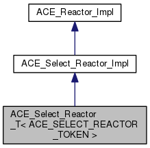
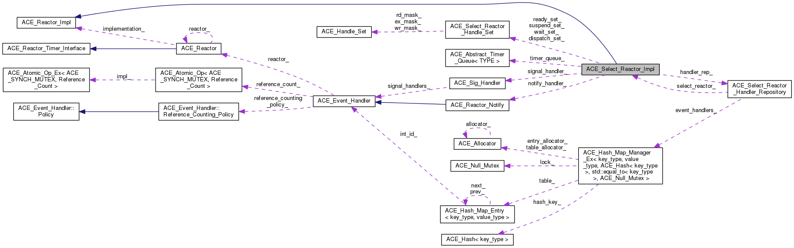
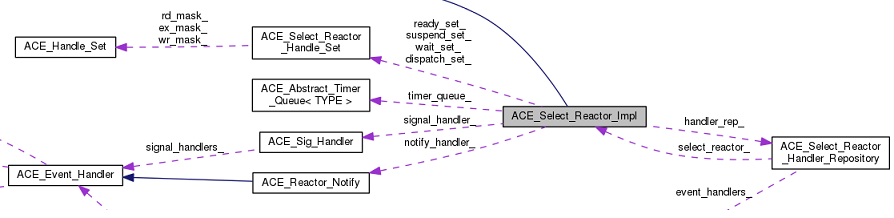
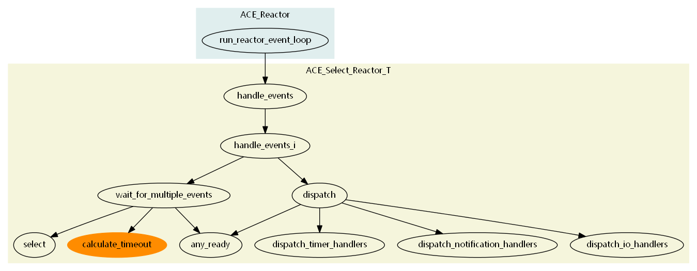

.. contents:: 本章目录
   :depth: 3

.. highlight:: c++

ACE_Select_Reactor_T 介绍
=========================

该类继承自类ACE_Select_Reactor_Impl，实现了对IO时间、信号量、定时器的分发处理，公共的函数需要ACE_Reactor_Token进行锁定。typedef ACE_Select_Reactor_T<ACE_Select_Reactor_Token> ACE_Select_Reactor定义了常用的ACE_Select_Reactor类，可以在程序中直接使用。

类继承图
--------

..

类协作图
-------------

..

.. rubric:: ACE_Select_Reactor 核心交互图，表明了 ACE_Select_Reactor 针对 Socket/IO, 定时器，通知和信号量的整体数据结构。

..

.. _mem_def:

类主要成员变量
---------------

ACE_Select_Reactor_Impl继承自 ACE_Reactor_Impl，在类ACE_Select_Reactor_Impl中定义了常用的成员变量：

.. rubric:: ace/Select_Reactor_Base.h

.. highlight:: c++
.. code-block:: c++
	:linenos:

	  /// 提供<ACE_HANDLE>到<ACE_Event_Handler *>的映射
	  ACE_Select_Reactor_Handler_Repository handler_rep_;    

	  /// 跟踪使用select函数返回的已触发的handle
	  ACE_Select_Reactor_Handle_Set dispatch_set_;

	  /// 跟踪要被select函数跟踪的句柄
	  ACE_Select_Reactor_Handle_Set wait_set_;

	  /// 跟踪当前被挂起的句柄
	  ACE_Select_Reactor_Handle_Set suspend_set_;

	  /// 跟踪我们感兴趣但不使用select函数触发的其他类型的各种句柄，例如 handle_*() 函数的返回值大于 0
	  ACE_Select_Reactor_Handle_Set ready_set_;

	  /// 定义时间轮队列指针，默认为：ACE_Timer_Heap
	  ACE_Timer_Queue *timer_queue_;

	  /// 处理信号量而不是用全局/静态的变量
	  ACE_Sig_Handler *signal_handler_;

	  /// 回调对象用于唤醒睡眠中的ACE_Select_Reactor，默认为ACE_Select_Reactor_Notify
	  ACE_Reactor_Notify *notify_handler_;

          /// 跟踪是否需要我们自己负责删除时间队列标志
	  bool delete_timer_queue_;

	  /// 跟踪是否需要我们自己删除信号句柄
	  bool delete_signal_handler_;

	  /// 跟踪是否需要我们自己删除通知句柄
	  bool delete_notify_handler_;

	  /// 是否进行初始化的标记
	  bool initialized_;

	  /// 是否自动重启<handle_events>的事件循环，如果select被信号量中断
	  bool restart_;

          /// 表明ACE_Select_Reactor主线程在<notify>回调等待列表中的位置。如果等于-1表明在list的尾部，
          /// 0表明在队列首部，如果大于1表明队列等待队列需要处理的数目
	  int requeue_position_;

	  /// 创建该类的的原始线程
	  ACE_thread_t owner_;

          /// 如果为true表明state已经在ACE_Event_Handler派发过程中发生了变化。这用于确定我们是否
          /// 需要在<Select_Reactor>的<wait_for_multiple_events>循环中做做另外一次迭代
	  /// ACE_Select_Reactor_Impl::clear_dispatch_mask (ACE_HANDLE handle,ACE_Reactor_Mask mask)中修改了
	  /// dispatch_set_中的handle的mask，则会将该状态设置成true。
	  bool state_changed_;

          /// 如果为false，则reactor在事件分发过程中将不屏蔽信号量。这对于不注册任何信号量句柄的程序非常有用，
          /// 如果修改这个mask的值，可以减少内核层次锁的开销
	  bool mask_signals_;

.. note::
	
	其中ACE_Select_Reactor_Handler_Repository handler_rep_的数据结构定义，可参见 :ref:`event_handlers_def` 。
	
事件处理函数调用图
-------------------

.. note::
	
	``calculate_timeout`` 函数的调用为类实现中 ``timer_queue_`` 时间队列中最早到期时间，以便设置后续 ``select`` 调用函数的超时时间，从而实现了时间队列与IO句柄触发的整合。 

事件处理主流程
---------------
.. rubric:: ace/Reactor.cpp
.. literalinclude:: ace/Reactor.cpp
    :linenos:
    :lines: 256-297
    :emphasize-lines: 12
..

行12行，Reactor调用了其实现者的 ``handle_events(ACE_Time_Value *max_wait_time)`` 函数，实现类的handle_event函数承担了主要工作的分发和处理。

handle_events 函数流程
++++++++++++++++++++++++++++++++++++++++++++++

.. rubric:: ace/Select_Reactor_T.cpp handle_events 函数
.. literalinclude:: ace/Select_Reactor_T.cpp
    :linenos:
    :lines: 1405-1443
    :emphasize-lines: 16,37
..

handle_events_i 函数流程
++++++++++++++++++++++++++++++++++++++++++++++++

.. rubric:: ace/Select_Reactor_T.cpp handle_events_i 函数
.. literalinclude:: ace/Select_Reactor_T.cpp
    :linenos:
    :lines: 1444-1477
    :emphasize-lines: 18-19,22-23
..

行18, ``this->wait_for_multiple_events (this->dispatch_set_,max_wait_time)`` 实现了对于可分发句柄集的获取。

行21，``this->dispatch (number_of_active_handles,this->dispatch_set_)`` 实现了对于分发句柄集的处理。

wait_for_multiple_events 函数
~~~~~~~~~~~~~~~~~~~~~~~~~~~~~~~~~
.. rubric:: ace/Select_Reactor_T.cpp wait_for_multiple_events 函数
.. literalinclude:: ace/Select_Reactor_T.cpp
    :linenos:
    :lines: 1073-1150
    :emphasize-lines: 12,25-26,38-42
..

行12,，``this->any_ready(dispatch_set)`` 实现了获取不需要select函数触发的其他类型满足触发条件的句柄

行25-26，``this->timer_queue_->calculate_timeout(max_wait_time,&timer_buf)`` 实现了对定时器队列的超时的计算

行38-42，``ACE_OS::select(width,dispatch_set.rd_mask_,dispatch_set.wr_mask_,dispatch_set.ex_mask_,this_timeout)`` 实现了对使用select函数返回的已触发的handle的跟踪

dispatch 函数
~~~~~~~~~~~~~~~~~~~~~~~~~~~~~~

.. rubric:: ace/Select_Reactor_T.cpp dispatch 函数
.. literalinclude:: ace/Select_Reactor_T.cpp
    :linenos:
    :lines: 1285-1393
    :emphasize-lines: 52,66,81-84,90-93
..

处理顺序：

#. ``dispatch_timer_handlers`` 处理分发定时器，定时器的处理优于Socket/IO的处理。 展开流程见： :ref:`timer_reactor`。
#. ``dispatch_notification_handlers`` 处理分发通知类消息。展开流程见： :ref:`notify_reactor`。
#. ``dispatch_io_handlers`` 处理分发 io handlers。展开流程见： :ref:`handler_reactor`。

