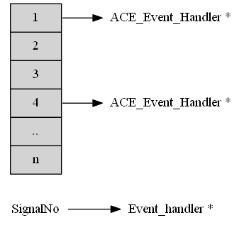
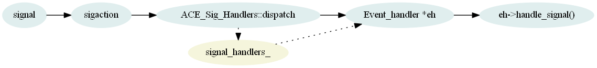

.. contents:: 本章目录
   :depth: 3

信号量的管理
=============

全局信号量数据结构
-----------------------------

全局变量：``ACE_Event_Handler *ACE_Sig_Handler::signal_handlers_[ACE_NSIG];``

.. highlight:: c++

.. _ace_signal_handler_dispatcher_def:

信号量的注册
-------------------

信号量结构定义

.. rubric:: ace/Sig_Handler.cpp 
.. literalinclude:: F:\ACE-6.2.4\ACE_wrappers\ace\Sig_Handler.cpp
    :linenos:
    :lines: 16-42
    :emphasize-lines: 4,7,10,13,22

.. rubric:: ace/Sig_Handler.cpp register_handler 函数
.. literalinclude:: F:\ACE-6.2.4\ACE_wrappers\ace\Sig_Handler.cpp
    :linenos:
    :lines: 179-199
    :emphasize-lines: 14

.. rubric:: ace/Sig_Handler.cpp register_handler_i 函数
.. literalinclude:: F:\ACE-6.2.4\ACE_wrappers\ace\Sig_Handler.cpp
    :linenos:
    :lines: 141-175
    :emphasize-lines: 25,29

行25，指定了注册到 ``sigaction`` 中的信号量处理函数 ``ace_signal_handler_dispatcher`` ，其定义参见 :ref:`ace_signal_handler_dispatcher_def` 。

.. rubric:: ace/Signal.inl register_action 函数
.. literalinclude:: F:\ACE-6.2.4\ACE_wrappers\ace\Signal.inl
    :linenos:
    :lines: 182-189
    :emphasize-lines: 7
..

信号量处理流程：``信号量发送(sigaction) -> ACE_Sig_Handlers::dispatch(signum, info, context) -> event_hanlder->handle_signal(signum, info, context)``。

信号量的删除
-------------

信号量的删除和添加的处理流程相反，从全局变量 ``signal_handlers_`` 数组中将 *signum* 对应的 *ACE\_Event\_Handler* 指针删除掉。 

信号量注意事项
--------------

当前 ``ACE_Sig_Handler`` 实现了一个信号量对应于一个事件处理句柄，如果针对同一个信号量多次添加事件处理句柄，则最终只保留为 **最后一次** 添加的值

.. note::
	
	当前 ``ACE_Select_Reactor`` 的成员变量 :ref:`mem_def` 中信号量定义的结构为 ``ACE_Sig_Handler``，实现了一个信号量对应于一个事件处理句柄，如果
	针对同一个信号量多次添加事件处理句柄，则最终只保留为最后一次添加的值。*Sig_Handler.h* 定义的 ``ACE_Sig_Handlers``，则实现了一个信号量对应于
	多个事件处理句柄，但是截至 **ACE6.2.4** 版本，还未真正在 *Select_Reactor* 类中替换。