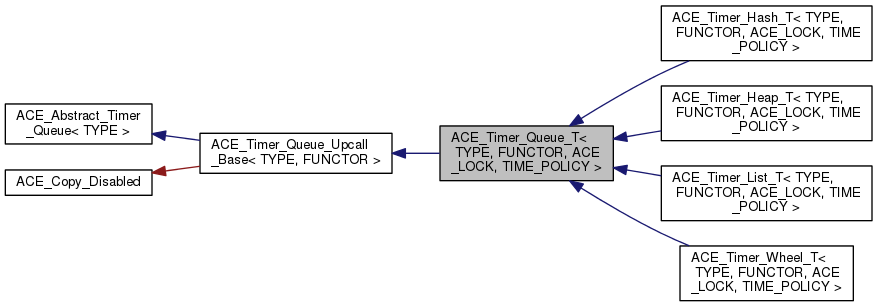
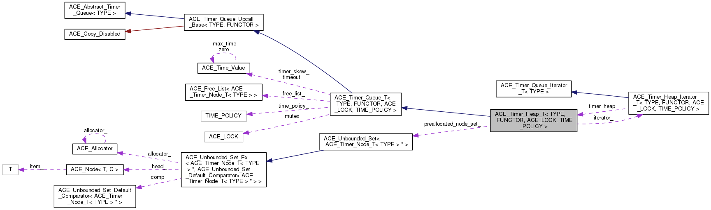
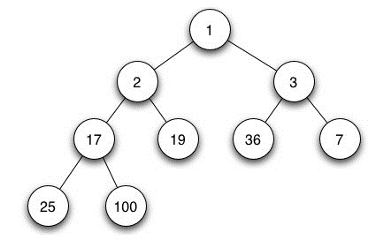
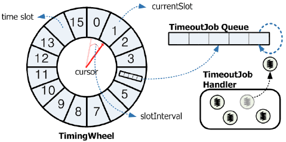

.. contents:: 本章目录
   :depth: 3

定时器管理
==========

定时器类继承图
----------------

.. highlight:: c++

其中 ``ACE_Abstract_Timer_Queue`` 类为所有定时器队列的基类，提供一个统一的接口，而不管加锁策略、回调机制、内部实现。该类的主要目的是为Reactor实现了一个统一的接口类，从而是Reactor无须了解定时器队列的内部实现机制。 ``ACE_Timer_Queue_T<TYPE, FUNCTOR, ACE_LOCK, TIME_POLICY>`` 为定时器队列提供了公共的接口，从该类派生的类包括 ``ACE_Timer_Hash_T``, ``ACE_Timer_Heap_T`` , ``ACE_Timer_List_T``, ``ACE_Timer_Wheel_T`` 4中类型的时间队列的实现。本例中主要分析 ``ACE_Timer_Heap_T`` 类的主要数据结构和实现机制。

.. highlight:: c++

.. rubric:: ACE_Timer_Queue_T 类定义原型

.. code-block:: c++
	:linenos:

	template <class TYPE,class FUNCTOR,class ACE_LOCK, typename TIME_POLICY=ACE_Default_Time_Policy>    
		class ACE_Timer_Queue_T : public ACE_Timer_Queue_Upcall_Base<TYPE,FUNCTOR>
..

类协作图
---------------

定时器的数据结构
------------------------

.. rubric:: ACE_Timer_Queue_T 类成员变量 
.. literalinclude:: ace/Timer_Queue_T.h
    :linenos:
    :lines: 216-236
    :emphasize-lines: 6,9
..

Heap Timer基础知识
+++++++++++++++++++++++++++++
min-heap，就是 child node value 一定小于 parent node value 的 binary-tree。因此，获取 min value，只需要 pop root node 即可。

在ACE_Time_Heap类中，每个节点结构如下：

.. highlight:: c++

.. code-block:: c++
  :linenos:
  :emphasize-lines: 3,4,7

  ACE_Event_Handler * type_; 		// 时间处理的回调类
  const void *act_;  			// 异步完成的token
  ACE_Time_Value timer_value_;		// 要超时的时间值
  ACE_Time_Value interval_;             // 周期定时器的周期值
  ACE_Timer_Node_T<TYPE> *prev_;        // 前一个节点
  ACE_Timer_Node_T<TYPE> *next_;        // 后一个节点
  long timer_id_;                       // 定时器的id，主要用于取消

..

.. _timer_reactor:

定时器与Select_Reactor的分发集成
-----------------------------------

``ace/Select_Reactor_T.cpp`` ``dispatch`` 函数中调用 ``dispatch_timer_handlers`` 函数处理定时器队列。

.. rubric:: Select_Reactor_T.cpp  ``dispatch_timer_handlers`` 函数
.. literalinclude:: ace/Select_Reactor_T.cpp
    :linenos: 
    :lines: 1151-1158
..

定时器队列的 expire 函数
++++++++++++++++++++++++++
.. rubric:: Timer_Queue_T.inl  ``expire`` 函数 
.. literalinclude:: ace/Timer_Queue_T.inl
    :linenos: 
    :lines: 25-32
..

.. rubric:: Timer_Queue_T.cpp  ``expire`` 函数 
.. literalinclude:: ace/Timer_Queue_T.cpp
    :linenos: 
    :lines: 253-291
    :emphasize-lines: 20,29
..

其中 29行 为调用该超时节点的 ``handle_timeout`` 函数的包装。

定时器队列的 dispatch_info_i 函数
++++++++++++++++++++++++++++++++++++

.. rubric:: Timer_Queue_T.cpp  ``dispatch_info_i`` 函数 
.. literalinclude:: ace/Timer_Queue_T.cpp
    :linenos: 
    :lines: 396-437
    :emphasize-lines: 14,17, 20-28
..

定时器队列的 upcall 函数
++++++++++++++++++++++++++

.. rubric:: Timer_Queue_T.inl  ``upcall`` 函数 
.. literalinclude:: ace/Timer_Queue_T.inl
    :linenos: 
    :lines: 44-53
..

其中 14行获取最小超时时间节点，行17获取超时节点的相关信息，20-28 行为处理周期定时器。

定时器注册
------------------------

schedule 函数
+++++++++++++++++++++++++++++

.. rubric:: ACE_Timer_Queue_T schedule 函数 
.. literalinclude:: ace/Timer_Queue_T.cpp
    :linenos:
    :lines: 224-252
    :emphasize-lines: 11-15,21-24
..

.. _upcall_def:

schedule_i 函数
+++++++++++++++++++++++++++++

``schedule_i`` 函数在其继承类实现，本例以 ACE_Timer_Heap_T 类为例分析。

.. rubric:: ACE_Timer_Heap 的定义 
.. literalinclude:: ace/Timer_Heap.h
    :linenos:
    :lines: 29-32
..

.. rubric:: Timer_Heap_T.cpp  schedule_i 函数 

.. literalinclude:: ace/Timer_Heap_T.cpp
    :linenos:
    :lines: 683-718
    :emphasize-lines: 19-21,29
..

分配的节点类型为： ``ACE_Timer_Node_T<TYPE>``，然后设置相关信息，调用 ``insert`` 函数插入。

.. rubric:: Timer_Queue_Iterator.h  ``ACE_Timer_Node_T`` 类成员变量 
.. literalinclude:: ace/Timer_Queue_Iterator.h
    :linenos:
    :lines: 128-148
    :emphasize-lines: 15,18
..

insert 函数
+++++++++++++++++++++++++++++

.. rubric:: ACE_Timer_Heap_T.cpp insert 函数 
.. literalinclude:: ace/Timer_Heap_T.cpp
    :linenos:
    :lines: 520-534
    :emphasize-lines: 9-12
..

reheap_up 函数
+++++++++++++++++++++++++++++

.. rubric:: ACE_Timer_Heap_T.cpp reheap_up 函数 
.. literalinclude:: ace/Timer_Heap_T.cpp
    :linenos:
    :lines: 490-520
    :emphasize-lines: 14-15
..

.. rubric:: Timer_Heap_T.h  ``heap_`` 变量定义 
.. literalinclude:: ace/Timer_Heap_T.h
    :linenos:
    :lines: 284-292
    :emphasize-lines: 7
..

upcall_functor registration函数
++++++++++++++++++++++++++++++++

.. rubric:: Timer_Queue_T.h  ``upcall_functor ().registration`` 成员变量 
.. literalinclude:: ace/Timer_Queue_T.h
    :linenos:
    :lines: 58
..

根据 :ref:`upcall_def` 章节可知 ``FUNCTOR`` 定位对象 ``ACE_Event_Handler_Handle_Timeout_Upcall``。

.. rubric:: Timer_Queue_T.h  ``upcall_functor ().registration`` 成员变量 
.. literalinclude:: ace/Event_Handler_Handle_Timeout_Upcall.inl
    :linenos:
    :lines: 7-16
..

``upcall_functor ().registration`` 仅仅对 ``ACE_Event_Handler *event_handler`` 对象维护了引用计数的功能，无其他具体功能实现。

定时器取消
------------------------

.. rubric:: ACE_Timer_Heap_T.cpp cancel 函数 
.. literalinclude:: ace/Timer_Heap_T.cpp
    :linenos:
    :lines: 719-776
    :emphasize-lines: 19-20,44
..

定时器队列注意事项
----------------------------

ACE时间源
+++++++++++++++++++++++++++

1. ``ACE_OS::gettimeofday()`` 返回 ACE_Timer_Value 的静态方法。
2. ``ACE_High_Res_Timer::gettimeofday``, 返回“OS特有的高精度定时器的值”的静态方法，并且会将该值转化成 ACE_Timer_Value 单位。该定时器常常以系统CPU启动的“嘀嗒”数，而不是以实际的挂钟时间为基础。可以避免系统时间调整对于定时器的影响。

实时线程定时器
+++++++++++++++++++++++++++

对于实时性要求高的定时器，可以采用 ``ACE_Thread_Timer_Queue_Adapter`` 来实现，该类启动一个单独线程来进行定时器触发。具体使用样例可以参见：``ace\examples\timer_queue\Thread_Timer_Queue_Test.cpp``。

各种定时器队列对比
----------------------

==================    =====================================================================================================================
    名称                      描述                                           
==================    =====================================================================================================================
ACE_Timer_Heap      		数组中实现部分有序，几乎完整的二叉树。         一般和最坏O(lgn)。
ACE_Timer_Wheel     		使用含有循环缓冲区的timing wheel。            一般情况下以O(1)时间调度，取消和分配定时器。最坏需要O(n)。
ACE_Timer_Hash      		使用哈希表来管理队列。                        一般情况下以O(1)时间调度，取消和分配定时器。最坏需要O(n)。
ACE_Timer_List     		绝对定时器链表，并按照递增的最后期限排序。      一般情况下和最坏情况下性能都是 O(n)，但是使用内存最少。
==================    =====================================================================================================================

Timer Wheel 简单介绍
+++++++++++++++++++++++

如果定时器时间范围跨度较大，就不能只使用单个时间轮来实现，需要采用分层次 Timer Wheel 来实现。

**参考文档：**

1. `More Efficient Timer Implementation using TimerWheel <http://www.cubrid.org/blog/dev-platform/more-efficient-timer-implementation-using-timerwheel/>`_ 

2. `Linux 下定时器的实现方式分析 <https://www.ibm.com/developerworks/cn/linux/l-cn-timers/>`_

3. `《Hashed and hierarchical timing wheels: efficient data structures for implementing a timer facility》 <http://www.cs.columbia.edu/~nahum/w6998/papers/sosp87-timing-wheels.pdf>`_

4. `简谈一下时间轮 <http://bookjovi.iteye.com/blog/1329614/>`_

